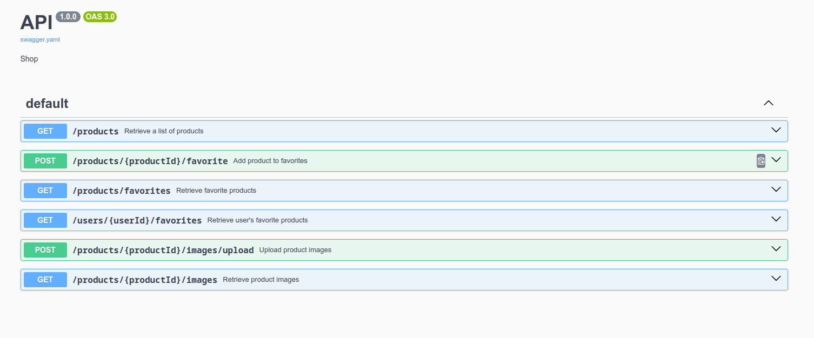

For this task, the description is very long, so I put it on a separate `README_task_description.md` file.

### Solution A. REST API
Serve `index.html` by `http-server` and interact with `swagger.yaml` file



### Solution B. Product Class
```php
<?php
namespace Market;

require_once '../bootstrap.php';

use AwsS3\Client\AwsStorageInterface;

/**
 * Represents a single product record stored in DB.
 */
class Product
{
    /**
     * @var FileStorageRepository
     */
    private FileStorageRepository $fileStorageRepository;

    /**
     * @var AwsStorageInterface
     */
    private AwsStorageInterface $awsStorage;

    /**
     * @var string
     */
    private string $imageFileName;

    /**
     * @param FileStorageRepository $fileStorageRepository
     * @param AwsStorageInterface $awsStorage
     */
    public function __construct(FileStorageRepository $fileStorageRepository, AwsStorageInterface $awsStorage)
    {
        $this->fileStorageRepository = $fileStorageRepository;
        $this->awsStorage = $awsStorage;
    }

    /**
     * Returns product image URL.
     *
     * @return string|null
     */
    public function getImageUrl(): ?string
    {
        // Try to get image URL from file storage
        $fileUrl = $this->fileStorageRepository->getUrl($this->imageFileName);

        // If not found in file storage, try AWS S3
        if (!$fileUrl) {
            try {
                $awsUrl = $this->awsStorage->getUrl($this->imageFileName);
                return $awsUrl->__toString();
            } catch (\Exception $e) {
                // Handle AWS S3 exception
            }
        }

        return $fileUrl;
    }

    /**
     * Returns whether image was successfully updated or not.
     *
     * @return bool
     */
    public function updateImage(): bool
    {
        // Try to save image in file storage
        try {
            $this->fileStorageRepository->saveFile($this->imageFileName);
            return true;
        } catch (\Exception $e) {
            // If saving to file storage fails, try AWS S3
            try {
                $this->awsStorage->saveFile($this->imageFileName);
                return true;
            } catch (\Exception $e) {
                // Handle AWS S3 exception
                return false;
            }
        }
    }
}
```

### Solution C. Describe tests

#### Unit Tests:
1. **Product Class Tests**:
`getImageUrl()` , `updateImage()`
2. **FileStorageRepository Tests**:
`getUrl()`, `fileExists()`,`deleteFile()`
3. **AWS S3 Integration Tests**:
`getUrl()`, `AwsStorageInterface`, `isAuthorized()`

#### API Tests:
1. **Product API Endpoint Tests**:
- GET `/products/{productId}`
- POST `/products/{productId}/images`
2. **File Storage API Tests**:
- GET `/files/{fileName}`
- GET `/files/{fileName}/exists`
