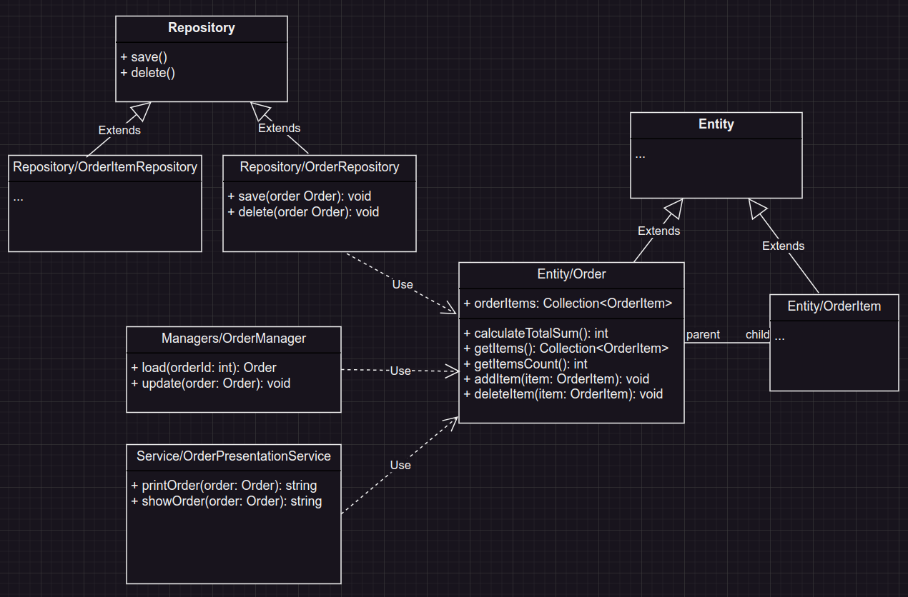

# #2 Basket Structure

We have a set of actions that we want to perform with orders:
```php
calculateTotalSum(){/*...*/ }
getItems(){/*...*/ }
getItemsCount(){/*...*/ }
addItem($item){/*...*/ }
deleteItem($item){/*...*/ }
printOrder(){/*...*/ }
showOrder(){/*...*/ }
load(){/*...*/ }
save(){/*...*/ }
update(){/*...*/ }
delete(){/*...*/ }
```
We need to create a class structure so that we can use these methods.

## Solution

