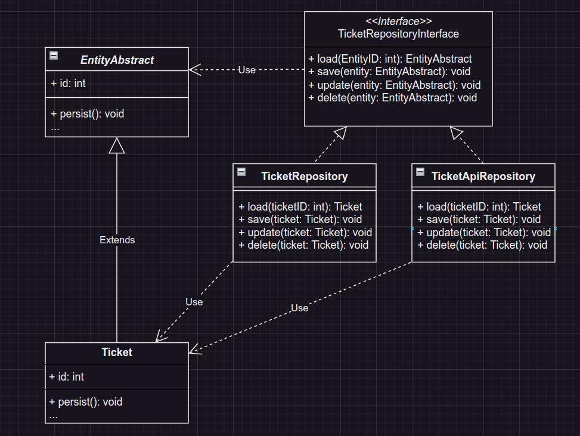

# #3 Ticket Repository

The task is to implement the ability to work with tickets stored on another server (via API).  
It is required to describe the structure of methods and classes that will allow loading tickets from both a database and another server (via API).  
`TicketRepository.php` class provided in this directory.

## Solution
No code for this task - I drew a UML diagram as a solution.

