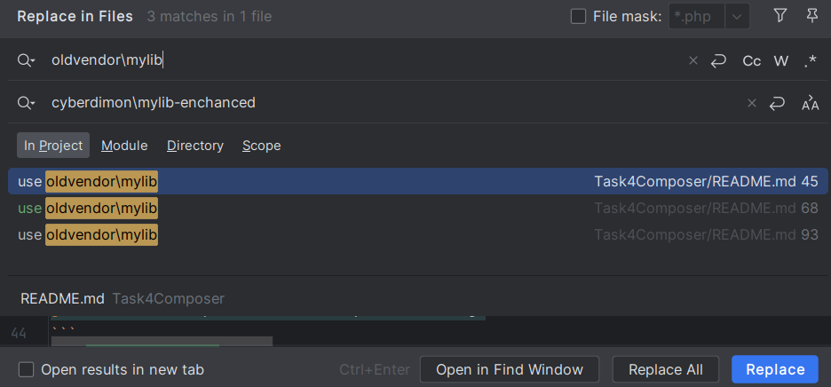

# #4 Composer: Dependency Update

You have a project that uses a library.

## What to do
- Make changes to the library and test its functionality in the project.
- After successful testing, release the project with the updated library.

## How to do it
Describe your actions in git and composer at all stages (development, testing, release, and deployment).

## Solution

### My suggestions from the task description
- I think the library is a package from the `vendor` directory.
- The library can be obtained from either a public Packagist repo or another team's private repo.  
  So, I cannot change code in the vendor directory - that's clear.

### How deeply is this library integrated into the project?
- How extensive is the quality of this library/package? Can some adapters, bridges, proxies, and other design patterns solve my needs?
- If I have a library in my vendor directory (no matter if I got it from a public Packagist repo or another team's private repo) - I still have the ability to fork and extend it for my needs. 
- Is it possible to open an issue, make a merge request to this library on public GitHub, or contact with  another team of private repo's maintainers?

### Let's suggest it is the worst-case scenario
- Library's architecture is not extensible, so it cannot be extended outside the vendor dir.
- It is deeply integrated into the project's code.
- it is a private repo.
- I cannot communicate with the maintainer's team.

## My actions

### Step №0 - Testing

It is important NOT to FORK any libraries BEFORE having everything covered by TESTS. By 'everything,' it means all classes in the app's code that depend on the library, which must be forked soon. This approach will save a significant amount of time after replacing the original library with an enhanced fork.

**Note:** If other libraries depend on the library needed to be forked and extended, it adds complexity to the process. I hope that these dependent libs are extensible and that the app's code using them is covered by tests :)

Test isolated methods, interactions between client code and library code, and add tests for the REST API.

Use static analysis provided by Psalm/PHPStan, Xdebug, Codeception, and PHPUnit.

```bash
git checkout -b mylib-functionality-test-coverage
```

### Step №1 - Development
```bash
git clone mylib_url mylib-enhanced
```  
Use a custom private repo on GitHub (for example)
```bash
git remote add fork mylib_enchanced_url
```  
Inside `mylib-enchanced` install dependencies with DEV - it will fetch phpunit and other stuff to easier dev process for our forked (or maybe custom) lib.
```bash
composer install --dev
```  
In `composer.json` of `mylib-enchanced` project add new vendor's name, new repo url, description etc.
```json
"name": "cyberdimon/mylib-enhanced",
"description": "Enhanced version of mylib",
"repositories": [
    {
        "type": "vcs",
        "url": "https://github.com/cyberdimon/mylib-enhanced.git"
    }
],

```  
Make all changes in code and tests that needed.  

In the original app project make a new branch
```bash
git checkout -b mylib-replacement
```
Change `composer.json` on original app too
```json
"repositories": [
    {
        "type": "vcs",
        "url": "https://github.com/cyberdimon/mylib-enchanced.git",
        "options": {
            "ssl": {
                "verify_peer": "true",
                "verify_peer_name": "true"
            }
        }
    }
],
"require": {
    "cyberdimon/mylib-enchanced": "dev-master"
}
```
```bash
composer install
```
And here you need to call a multiline replacement window by `Ctrl + Shift + r` on your phpstorm  

  

Replace all. Then run tests, fix bugs - that's it. 

Don't forget to remove old lib when you're done
```bash
composer remove oldvendor/mylib
```

### Step №3 Release
Depends on the company's flow. Use git tags, stage/development/prod branches, Swagger, Confluence, or README files for documentation - whatever fits best.

### Step №4 Deploy
Same as step 3 - Jenkins, Ansible, manual git deployment - whatever works best for your company now.
