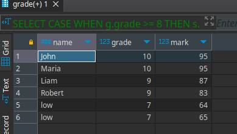

# #5 Student Grades SQL

You have a project that uses a library.

## Task A. Data Selection

Given a database with students and their grades. The `students` table contains the marks of each student, and the `grade` table contains the mapping of marks to the student's grade.

You need to write a query to the database that includes three columns: `name`, `grade`, and `mark`.
- The data should be ordered by descending grades, with higher grades displayed first.
- If there are multiple students with the same grade (8-10), order these specific students by their names in alphabetical order.
- If the grade is below 8, use "low" as their name and list them by grades in descending order.
- If there are multiple students with the same grade (1-7), order these specific students by their grades in ascending order.

## Task B. DDL Modification

It is assumed that the table with students will store data for more than two million students and will continue to grow. How would you modify the database tables, considering that the `grade` field from the `grade` table is always involved in queries to retrieve student data?

```sql
create table grade
(
    grade int null,
    min_mark int null,
    max_mark int null
);

create table students
(
    id int null,
    name varchar(100) null,
    marks int null
);
```

## Solution A.
```sql
SELECT
    -- bad studs are nameless )))
    CASE
        WHEN g.grade >= 8 THEN s.name
        ELSE 'low'
    END AS name,
    g.grade,
    s.marks as mark
FROM
    students s
JOIN
    -- have 10 grades, but only 6 real studs
    grade g ON s.marks BETWEEN g.min_mark AND g.max_mark
ORDER BY
    -- high grades first
    g.grade DESC,
    -- if grade > 8 by alphabetical stud's name 
    CASE
        WHEN g.grade >= 8 THEN s.name
    END ASC,
    -- if grade < 8 by grade
    CASE
        WHEN g.grade < 8 THEN g.grade
    END ASC;
```

**Result**  
